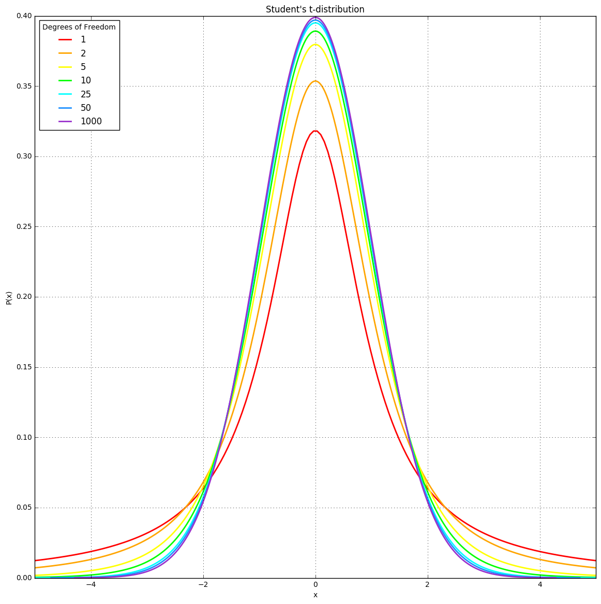

```python


```

# nm2762 review of yxh204


```python
import numpy as np
import pandas as pd
from scipy.stats import t, norm
import matplotlib.pylab as plt

%matplotlib inline
```


```python
DF = [1, 2, 5, 10, 25, 50, 1000]
cmap = ["#FF0000", "#FFA500", "#FFFF00", "#00FF00", "#00FFFF", "#1E90FF", "#9932CC"]
ax = plt.figure(figsize = (14, 14)).add_subplot(111)
for df, col in zip(DF, cmap):
    x = np.linspace(t.ppf(1e-5, df), t.ppf(0.99999, df), 1e6)
    ax.plot(x, t.pdf(x, df), lw = 2, label = df, c = col)
ax.set_xlim(-5, 5)
plt.xlabel("x"); plt.ylabel("P(x)")
plt.title("Student's t-distribution")
plt.legend(loc = 2, title = "Degrees of Freedom"); plt.grid(True)
plt.show()
```





# I found the plot well constructed. Maybe the choose of the colors is confusing. Some colors are too similar one to each other.  


```python

```
